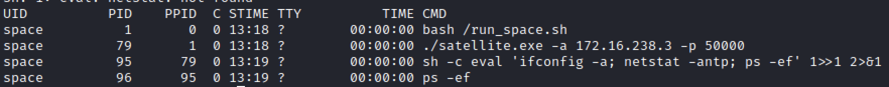
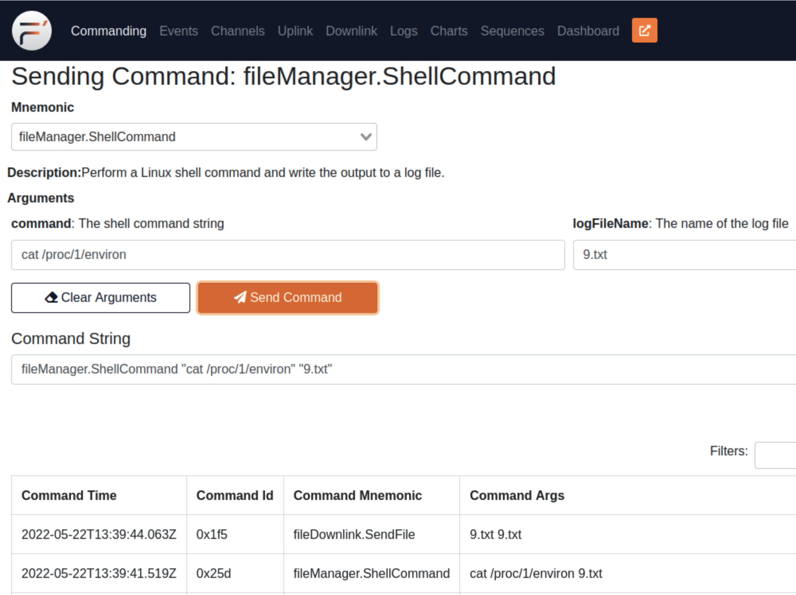
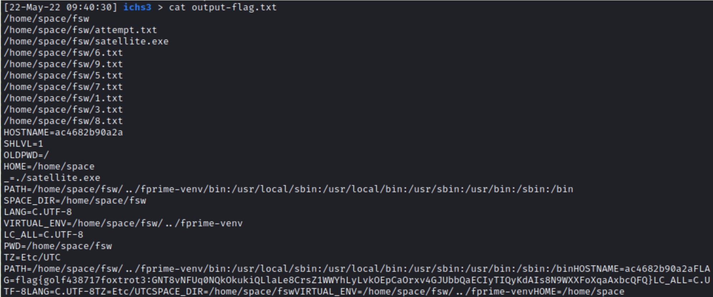

# SingleEventUpset - HAS3 Qualification Event Technical Paper

## I Can Haz Satellite - F'DA Approved Beef

```
The F'DA has hidden the beef in flight software on its new satellite.

Connect to the system and find our beef.

We are starting to get hungry.

Ticket
Present this ticket when connecting to the challenge:
ticket{golf438717foxtrot3:GKOsNy1GKV07-tLrAZHYMNw3LfcEKmBT5q87PGppkWZUFbVSykNzkoKLMGiM_1Za9w}
Don't share your ticket with other teams.

Connecting
Connect to the challenge on:
fda_approved_beef.satellitesabove.me:5500

Using netcat, you might run:
nc fda_approved_beef.satellitesabove.me 5500
```

Prompt upon connecting:

```
Ticket please:
ticket{golf438717foxtrot3:GKOsNy1GKV07-tLrAZHYMNw3LfcEKmBT5q87PGppkWZUFbVSykNzkoKLMGiM_1Za9w}

Please wait 60 seconds for the challenge to come online. Sorry for the wait.
Wait for system to initialized
Challenge Web Page Starting at http://54.237.163.124:28334
CLI available at 54.237.163.124:28335
Now F'DA Approved Beef
Get the system to return flag in telemetry to win
Time remaining to solve: 900 seconds
```

The web application allowed interaction with the remote system through numerous commands.  The most useful were: `fileManager.ShellCommand`, `fileDownlink.SendFile`, and the interface to access the downlink to download remote files.  The ShellCommand could run shell commands with the output saved as a text file.  The output could be sent using the fileDownlink command and downloaded locally to review the output.  The team used this to run shell commands and gather data such as process listings, directory walks, and capture other local files such as `/run_space.sh` which launched the program environment.

 

```
[23-May-22 16:05:54] ichs3 > cat run_space.sh
cat: run_space.sh: No such file or directory
echo "Starting spacecraft"
cd /home/space/fsw/
echo "${FLAG}" > /home/space/fsw/.FlagData
unset FLAG
sleep 15
./satellite.exe -a 172.16.238.3 -p 50000
```

As seen above, the shell script used the `FLAG` environment variable.  We were able to access the flag by using `cat /proc/1/environ` to get the Shell Environment for the main initializing process’s PID.

 

 
