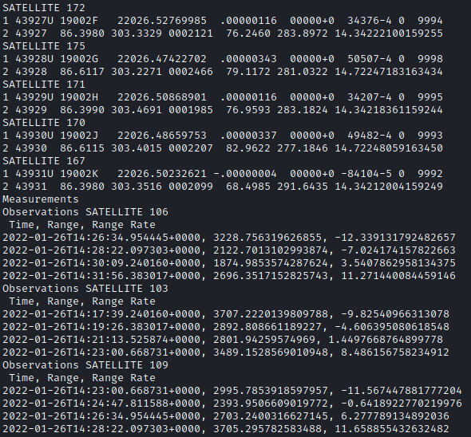
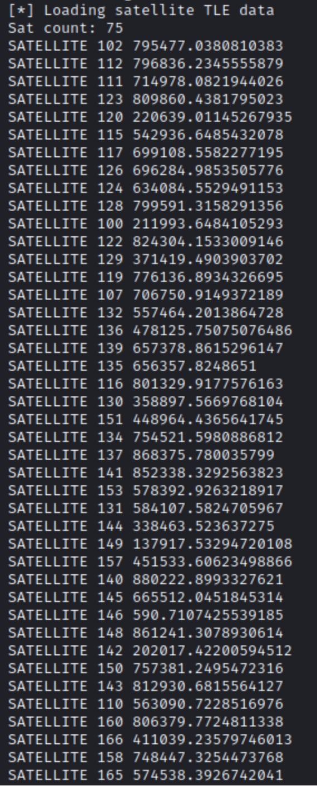
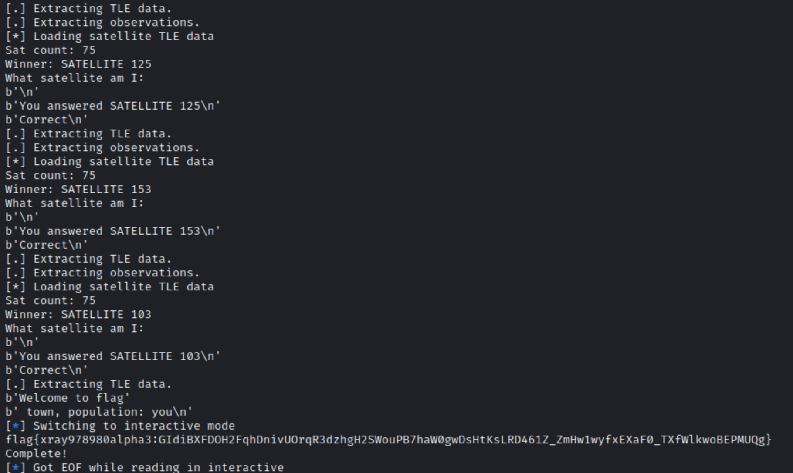

# SingleEventUpset - HAS3 Qualification Event Technical Paper

## Revenge of the Space Math - Crosslinks

```
Who am i?

Ticket
Present this ticket when connecting to the challenge:
ticket{xray978980alpha3:GEVStpar-o0kqFocgnPNX6wu1MD1pTLW04-zGZRmVrRs0Zkpo-R0Vad4vUcY8OO85A}
Don't share your ticket with other teams.

Connecting
Connect to the challenge on:
crosslinks.satellitesabove.me:5300

Using netcat, you might run:
nc crosslinks.satellitesabove.me 5300
```

Once connected, the problem provides a stream of data that includes numbered satellite’s TLE data followed by observations for numbered satellites, consisting of Time, Range, Range Rate (i.e time, distance, velocity).

Our team created scripts to automatically ingest and parse the inbound data and load it using Python TLE libraries.  Iterating over each satellite’s positioning and the provided observations, we had to see which data was most accurate, indicating which satellite we are -- aka, finding the outlier in our own distance calculations.

 

```python
#!/usr/bin/python3

from pwn import *
from skyfield.api import load, wgs84

import dateutil.parser

TARGET = b"crosslinks.satellitesabove.me"
PORT = 5300
TICKET = b"ticket{xray978980alpha3:GEVStpar-o0kqFocgnPNX6wu1MD1pTLW04-zGZRmVrRs0Zkpo-R0Vad4vUcY8OO85A}"

conn = remote(TARGET,PORT)
conn.recvuntil(b'Ticket please:')
conn.sendline(TICKET)

# TLE
#SATELLITE 106
#1 41917U 17003A   22026.58239212  .00000113  00000+0  33171-4 0  9990

#Measurements
#Observations SATELLITE 106
# Time, Range, Range Rate
# 2022-01-26T14:26:34.954445+0000, 3228.756319626855, -12.339131792482657

while True:
        print("[.] Extracting TLE data.")
        sat_tle = conn.recvuntil([b'Measurements', b'flag'])
        if b'flag' in sat_tle:
            print(sat_tle)
            data = conn.recvline()
            print(data)
            conn.interactive()
        with open('sat_tle', 'wb') as f:
            f.write(sat_tle)

        ts = load.timescale()

        print("[.] Extracting observations.")
        observations = conn.recvuntil(b'What satellite am I:')
        with open('observations', 'wb') as f:
            f.write(observations)

        print("[*] Loading satellite TLE data")
        sats_tle = load.tle_file('sat_tle')
        print(f"Sat count: {len(sats_tle)}")
        test = {}
        for sat in sats_tle:
            test[sat.name] = sat
        sats_tle = test

        lines = observations.split(b'\n')
        lines = lines[1:]
        obs = {}
        current = 0
        ready = False
        for line in lines:
            if line.startswith(b'Observations'):
                number = line.split()[2]
                key = f"SATELLITE {number.decode()}"
                obs[key] = []
                current = number
                continue
            if line.startswith(b' Time'):
                continue
           
            try:
                t, rng, rate = line.split(b',')
            except:
                break
            tmp = t.lstrip().rstrip()
            t = ts.utc(dateutil.parser.parse(tmp))
            rng = float(rng.lstrip().rstrip())
            rate = float(rate.lstrip().rstrip())
            entry = [t, rng, rate]
            obs[key].append(entry)
            
        errors = {}
        for sat in sats_tle.keys():
            name = sats_tle[sat].name
            if (name in obs):
                #print(f"Skipping {sats_tle[sat].name}")
                continue

            disterr = 0
            for observed_sat in obs.keys():
                test_sat = sats_tle[observed_sat]
                for times in obs[observed_sat]:
                    t, rng, rate = times
                    distance = (sats_tle[sat] - test_sat).at(t).distance().km
                    velocity = (sats_tle[sat] - test_sat).at(t).velocity.km_per_s
                    disterr += abs(distance - rng)
                    #print(f"Distance: {distance}")
                    #print(f"Range:    {rng}")
                    #print(f"Velocity: {velocity}")
                    #print(f"Rate:     {rate}")
            errors[name] = disterr

        winner = ""
        number = 100000000
        for i in errors.keys():
            #print(i, errors[i])
            if errors[i] < number:
                winner = i
                number = errors[i]
                
        print(f"Winner: {winner}")
        conn.sendline(winner)
        data = conn.recvline()
        print(data)
        data = conn.recvline()
        print(data)
        data = conn.recvline()
        print(data)
        #conn.close()
```

In the first round of data, the outlier was Satellite 146.  We were also surprised to see the data was not randomized, so each time the satellites were predictable after solving once.

 

 
