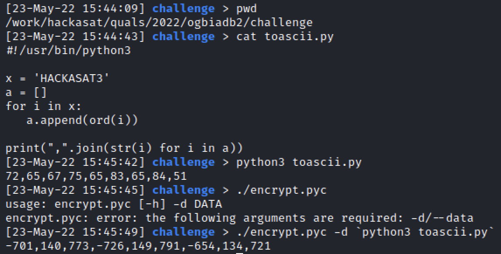
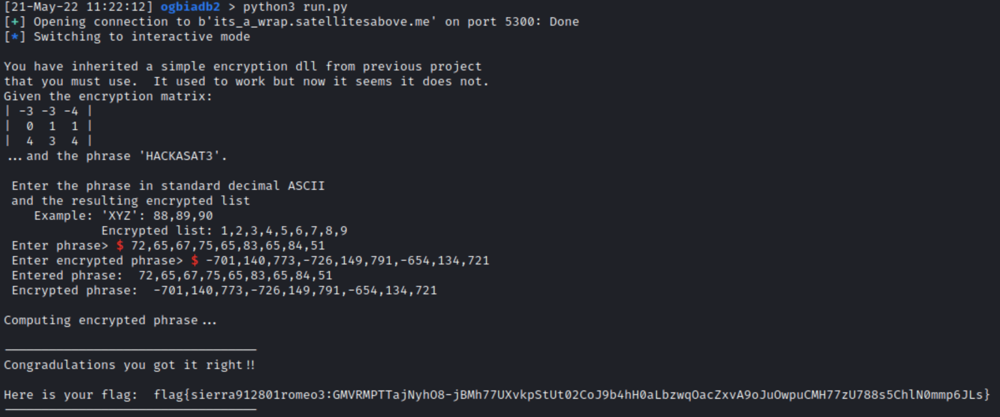

# SingleEventUpset - HAS3 Qualification Event Technical Paper

## The Only Good Bug is a Dead Bug - It's A Wrap

```
Do you like inception?

Ticket
Present this ticket when connecting to the challenge:
ticket{sierra912801romeo3:GOq2U2XSzjTHHgw3tF8cVCRHx6PsOdfDzAZ38K68t4l5j4gxlmecp5M8XtK0HTanxg}
Don't share your ticket with other teams.

Connecting
Connect to the challenge on:
its_a_wrap.satellitesabove.me:5300

Using netcat, you might run:
nc its_a_wrap.satellitesabove.me 5300

https://static.2022.hackasat.com/n50xglah3x4cbisdicrwnc2iw4sq
```

Prompt upon connecting:

```
You have inherited a simple encryption dll from previous project
that you must use. It used to work but now it seems it does not. 
Given the encryption matrix: 
| -3 -3 -4 |
|  0  1  1 |
|  4  3  4 | 
...and the phrase 'HACKASAT3'. 

 Enter the phrase in standard decimal ASCII
 and the resulting encrypted list 
    Example: 'XYZ': 88,89,90 
             Encrypted list: 1,2,3,4,5,6,7,8,9 
 Enter phrase>
```

Each team was also given two files, downloaded for the challenge: encrypt.pyc (a compiled Python 3.10 program and libfoo.so, a shared object file.

Instead of performing any reversing, we made the encrypt.pyc file executable and ran it.  It expected data input to encrypt, likely using the SO library.  After converting HACKASAT3 to ASCII and using it as input, the output from the encrypt.pyc worked as the solution to the problem over the nc connection.

 

 
