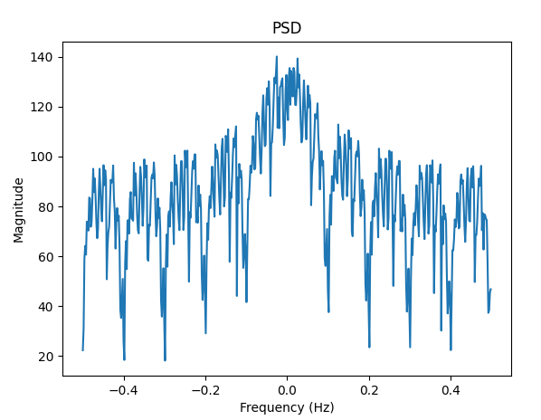
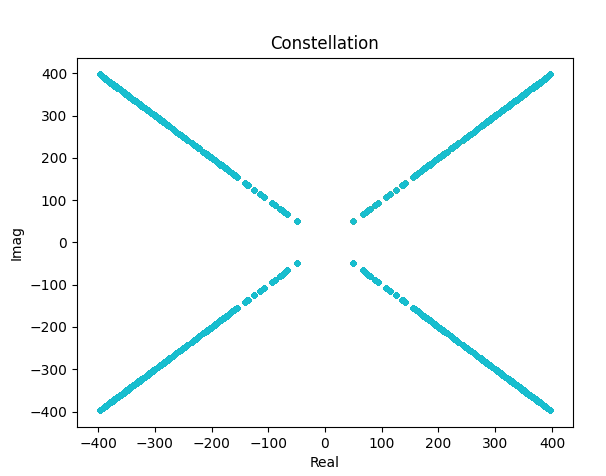

# SingleEventUpset - HAS3 Qualification Event Technical Paper

## We Get Signal - Power Point

```
Break out Microsoft Office because its time to make some slides… just kidding!

There is a satellite out there transmitting a flag. You are on a moving platform and you don't know how you will be moving or where the transmitter is or how the transmitter is moving. Luckily you have a steerable antenna! To get the flag:

1. Find the transmitter by steering the antenna.
2. Keep the antenna pointed at the transmitter and try to maximize signal power.
3. Decode the samples coming in from your receiver.

Your co-worker told you they think the satellites is "North-ish and sort of close to the horizon"

Send az, el commands to the antenna; an antenna command is formatted as a string for example if az=77.1 and el=73.2

send: 77.10,22.2\n

Please send one command at a time.

After you send a command the receiver will reply with a fixed number of IQ samples via TCP.

Ticket
Present this ticket when connecting to the challenge:
ticket{victor364927uniform3:GOM2xeyAbcq1f-jBfGukLEIZEnR4zA9CE1oNF_WMieJnGayNhj052NJgyKDcOUNqLQ}
Don't share your ticket with other teams.

Connecting
Connect to the challenge on:
power_point.satellitesabove.me:5100

Using netcat, you might run:
nc power_point.satellitesabove.me 5100
```

Once connected to the challenge, two TCP/IP addresses would be provided, one for the sending commands to the antenna, and one for receiving the simulated data.  The first step of the challenge was to find the starting position of the antenna. A quick script was used to automate connecting to the challenge and setting up connections to both the command socket and data socket. 

```python
TARGET = b'power_point.satellitesabove.me'
PORT = 5100
TICKET = b'ticket{victor364927uniform3:GOM2xeyAbcq1f-jBfGukLEIZEnR4zA9CE1oNF_WMieJnGayNhj052NJgyKDcOUNqLQ}'

# connect and submit ticket
conn = remote(TARGET,PORT)
conn.recvuntil(b'Ticket please:')
conn.sendline(TICKET)

conn.recvuntil(b'Antenna pointing TCP server accepts commands at')
ip2 = str(conn.readline().decode())
ip2 = ip2.strip()
[ip2, port2] = ip2.split(":")

conn.recvuntil(b'Sample TCP server will provide samples at')
ip = str(conn.readline().decode())
ip = ip.strip()
[ip, port] = ip.split(":")
sample_server = remote(ip, port)
command_server = remote(ip2, port2)
```

After some quick manual testing, we realized that the data was 1024 samples per command, and each sample was 4 bytes. Based on this we assumed each sample would be encoded as complex32 values. This assumption would prove to be correct later as we began to analyze the data. Adding a simple function to send a single command and return the data, we were ready to begin searching for the transmitter. We also had the command append the data into a binary file after every collection so we could easily grab any samples we found during this preliminary scanning.

```python
def get_data(az, el):
    command = str(az) + "," + str(el)
    command_server.writeline(command)
    x = b""
    while len(x) < 8192:
        x += sample_server.read(4092)
    with open(file_name, 'wb') as f:
        f.write(x)
    x = np.frombuffer(x, dtype=np.complex)
    return x
```

Now that we had the basic tools built that we needed to begin looking for data, we could begin searching for the transmitter. Hoping to get a rough fix as a starting point, we set up a simple nested loop test every 10 degrees of both azimuth and elevation. At this point, we simply printed the samples to the screen to manually see when the data would change from mostly 0 values. Luckily, we got data very quickly at 10 degrees for azimuth and 20 degrees for elevation.  Now that we had a starting point, we quickly grabbed larger samples and broke into two teams. One team began to analyze the signal to prepare to demodulate a full capture, while the other team working on setting up a simple tracking method to capture the entire signal. The tracking team needed to have a method to evaluate just how strong the signal was at the current position and a simple mean of the magnitude of the samples proved sufficient for this purpose.

```python
def get_power(samples):
    return np.mean(np.abs(samples))
```

After a short amount of experimentation, a simple tracking method proved to be effective. The starting position was set to 10,20. From there a data capture would be taken, and the current power would be stored off. Next a position slightly off center in a random direction would be chosen and a capture taken. If the power at the new location was greater than the previous centered position, the new position would become center, and measurements would be taken off center in the same direction. This would continue until moving the center no longer proved to return higher power. This simple method proved to be sufficient to track changes to the position of the transmitter and allowed a full capture to be performed.

```python
position_az = 10
position_el = 20

radius = .01
while True:
    power = get_power(get_data(position_az, position_el))
    delta_az = random.choice([-1,0,1]) * random.random()
    delta_el = random.choice([-1,0,1]) * random.random()
    test_position_az = position_az + delta_az 
    test_position_el = position_el + delta_el 
    test_power = get_power(get_data(test_position_az, test_position_el))
    while test_power > power:
        position_az = test_position_az
        position_el = test_position_el
        power = test_power
        test_position_az = position_az + delta_az 
        test_position_el = position_el + delta_el 
```

While the tracking team was collecting a large enough data capture to include the flag, the Demodulation team was analyzing the signal. Plotting the Power Spectral Density of the early samples showed what appeared to be a signal with PSK modulation. 



After some quick testing, it appeared that there were 10 samples per symbol in this capture. Because the signal was very clean, without large amounts of noise, a simple decimation by 10 provided a very clean constellation graph. Instead of 4 “balls” as we would usually expect to see, we have X shape shown below. This was because the only real source of error was decreased amplitude as the tracking would begin to lose the signal, then adjust to maximize power.  



Based on the constellation we assumed QPSK, and took sign of each x,y value to map each point into the appropriate symbol.  With four different symbols, there are 24 permutations of symbol-to-bits mapping. Looping over each combination, then packaging the bits into bytes, we searched for the flag. However this did not yield immediate success. After testing a few variations of bit packing, it was discovered that each byte was sent least-significant bit first. We adjusted the bitmap tester to account for this, looped again, and found the flag. 

```
Found b'flag{victor364927uniform3:GAUNZDtaDg0D5b9SrZHhk06Q6cmz_vHxmQDTb_cswBg1ukawr_J5hAvRWWpotrP11PHnw4YnMBKG_F_obnqaDWU}'
Using Mapping
	(0, 0) -> (0, 0)
	(0, 1) -> (0, 1)
	(1, 0) -> (1, 0)
	(1, 1) -> (1, 1)
```
