Revenge of the Space Math:
Crosslinks

Here is the challenge:

Upon connecting to the challenge, and sending our ticket, we are greeted with a WALL of text:

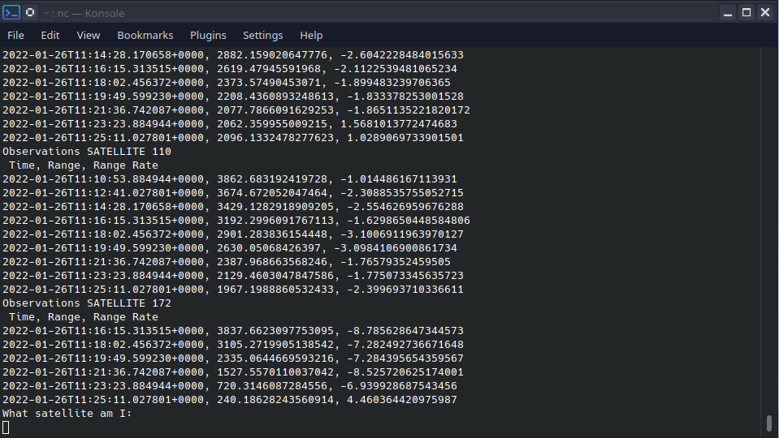

The data shown appears to be observations of various sattelites. For a number of satellites, there is one or more records each a Time, Range, and Range Rate. The challenge poses the question "What satellite am I?"

Scrolling back up to the top of this data, we can see the data set changes somewhere in the middle.

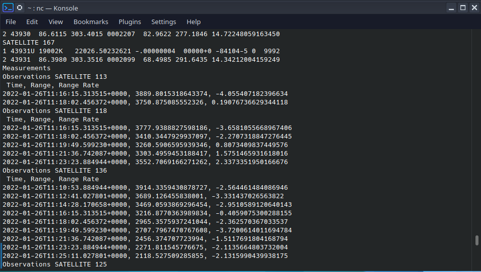

And scrolling the remainder of the way up, we see that the dataset stays int he same format right up to the beginning.

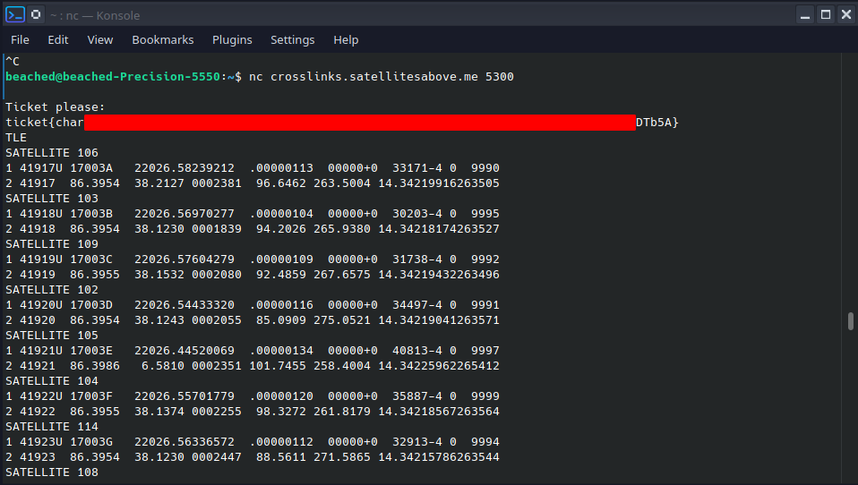

To identify which satellite made the observations, we first have to seperate out our data.
First Ill copy off the TLE data into its own file.

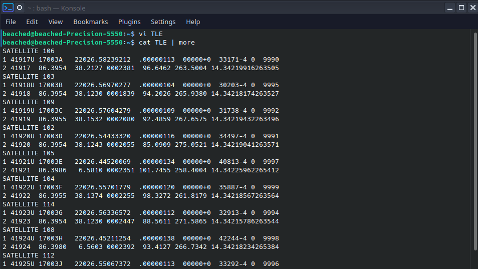

Then I will pull out a few observations that all contain an observation at the same timestamp.

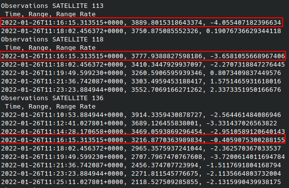

The TLE data is taken at various different times, and does not exactly line up with the oberservation times. In order to calculate the distances between two satellites at a given time, we will have to walk all our satellites position back in time to the observation timestamp. 

Luckily, SkyField library for python can do this for us. 
  
First we need to create a timescale object, and set it to the date our observations were taken.

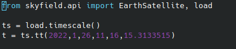

Next, lets bring in the TLE data for our chosen observed satellites.

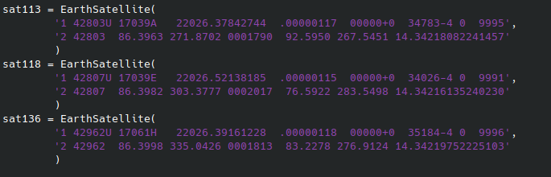

Now lets load all of the TLE data that has been given to us.

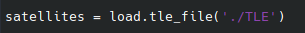

Loading the TLE data file will create an array of EarthSatellite objects which we can loop through. Our loop will calculate the position of our current satellite, as well as the three satellites we chose from our observation data, at the given time (Our observation time t). It will then calculate the distance between the current satellite, and each of the three observation satellites and print that distance out to us (in km). To fitler out some of the more extremely wrong distances, we will create a simple if statement to only print our satellite's name and the distances if they are close.

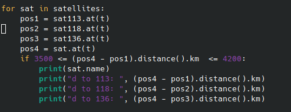

To make life easier, I'll also print the distances to each satellite we are looking for.

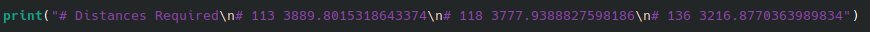

Here is what our completed script looks like:

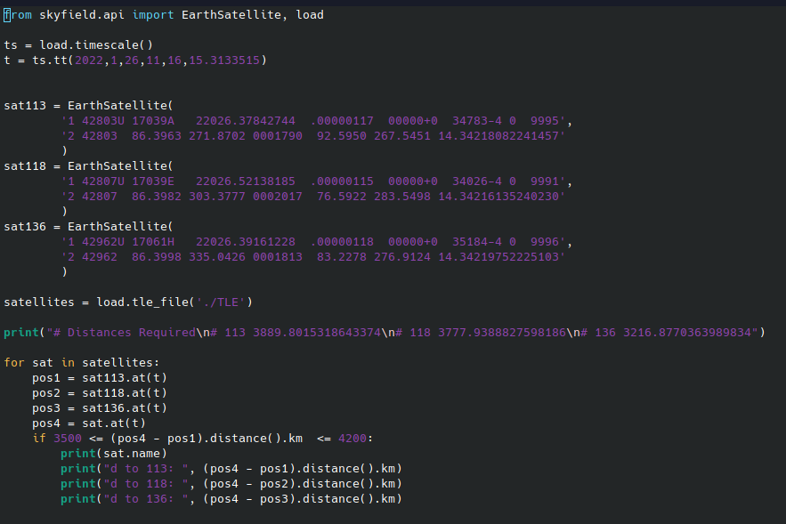

And when we run it, these are our results:

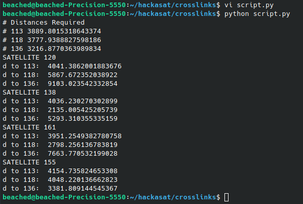

As we can see, none of our observastions exactly line up with expected distances. During the challenege we stumbled upon one very valuable piece of information:

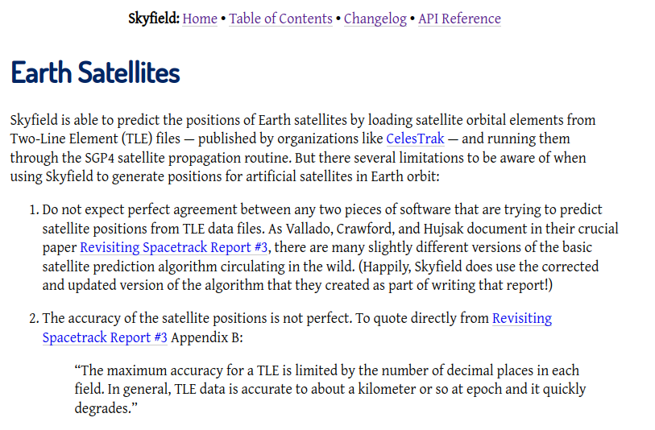

SkyField tells us not to expect perfect agreement between any two pieces of software trying to predict positions from TLE data, and that TLE data accuracy is limited. 

Most importantly, when we look at the distances identified, we see only one option that is a similar relation to our expected distances. Distance to 118 is slightly lower than distance to 113, and 136 is below 118 be a few thousand. Of our results, only SATELLITE 155 fits the bill.

When we submit SATELLITE 115 as our answer, we are told it is correct, and a new set of data spits out...

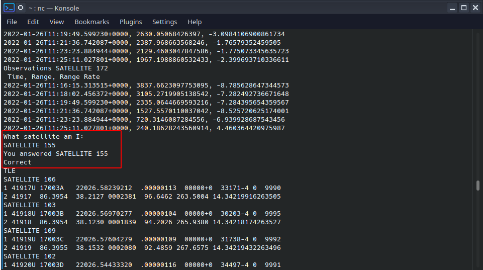

Repeat four more times for the flag:

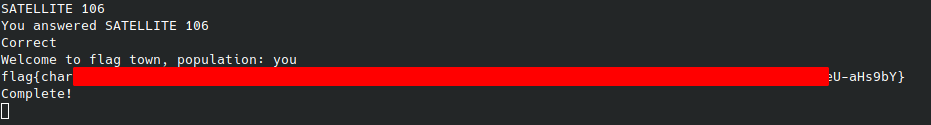

