# 2022-Hack-a-Sat-3 Qualification Event Technical Paper
## Contents
- [2022-Hack-a-Sat-3 Qualification Event Technical Paper](#2022-hack-a-sat-3-qualification-event-technical-paper)
  - [Contents](#contents)
- [1. Crosslinks](#1-crosslinks)
  - [Analysis](#analysis)
  - [Solution](#solution)
- [2. Once Unop a Djikstar](#2-once-unop-a-djikstar)
  - [Analysis](#analysis-1)
  - [Solution](#solution-1)
  - [djikstar solver](#djikstar-solver)
- [3. Power Point](#3-power-point)
  - [Analysis](#analysis-2)
  - [Solution](#solution-2)
- [4. Small Hashes Anyways](#4-small-hashes-anyways)
  - [Analysis](#analysis-3)
  - [Solution](#solution-3)
- [5. Space Jam](#5-space-jam)
  - [Analysis](#analysis-4)
  - [Solution](#solution-4)

# 1. Crosslinks
* Category: Revenge of the Space Math
* Points: 55
* Solves: 81
* Description:

```
Who am I?
```

Analysis
--------------
*Contributors Blaine K, Jon F, Rebecca R, Adam C, Dom D, Nick S, Zack KS*

The given information was TLE data for roughly 79 satellites and a set of observations. Based on this we assumed that the satellite we were trying to identify was the satellite doing the observing. At first glance it appeared that a quick brute force may be the fastest way to solve this problem.

To automate guessing the satellite we wrote a python script to loop a guess iterator over the range of satellite IDs (100-180). Based on our assumption that we were guessing the observer, we were able to speed up our process by excluding the observed satellites from our guesses. We stored the observed satellites in an array such that for each iteration the script checked if the current guess was in the observed array. If it was, we moved to the next iteration without guessing. If not, we went ahead and connected to the server and made the guess. The list of observed satellites changed for each round (except 2 and 3).


```python
# round 1
observed = ['104', '114', '123', '126', '128', '107', '148', '150', '165', '163', '170']

# round 2
observed = ['106', '105', '108', '113', '120', '118', '121', '133', '100', '151', '153', '144', '149', '140', '146', '148', '150', '152', '164', '171']

# round 3
observed = ['106', '105', '108', '113', '120', '118', '121', '133', '100', '151', '153', '144', '149', '140', '146', '148', '150', '152', '164', '171']

# round 4
observed = ['108', '136', '125', '138', '130', '146', '142', '147', '110', '155']

# round 5
observed = ['138', '130', '157', '146', '142', '147', '110', '155', '156', '173', '172']
```

In order to know when the correct satellite was guessed we added a trigger of "orrect" so that the script would either print "Incorrect" or "Correct" for each guess. The "c" was omitted to account for it being capitalized in "Correct" and small in "Incorrect".

```python
print(conn.recvuntil('orrect'))
```

As we got into the later rounds, starting around round 3, we noticed the script was running considerably slower due to the time taken to enter the guesses from the previous rounds. At this point we split up the guesses between two computers. One iterating through the first half and the other iterating through the second half. Splitting up the computation was sufficient for the number of rounds it took to guess all the satellites but would not have scaled well if there were, say, 100 rounds. One way to help overcome the slow computation times would be to reduce the number of potential guesses. If possible, use the given data to determine which satellites are within line-of-sight of one another and rule out all other satellites. The ruled out satellites could be stored in an array and evaluated the same as the observed satellites.

Solution
-----------

Below is the main loop of the python script used guess the satellite. The script was modified each round to update the array of observed satellites and automate entering the correct guesses from the previous rounds. The server only allowed for one guess at a time and booted us off if we guessed wrong. Therefore, the script had to connect to the server for each valid guess (valid meaning not in the observed array).

```python
for i in range(100,181):
    if str(i) in observed:
        continue
    
    else:
        host = "crosslinks.satellitesabove.me"
        port = 5300
        conn = remote(host, port)
        ticket = "ticket{tango9381foxtrot3:GC3Tyg-7Pm2Gpo3fbpuF6ChmynN9oGDh2lVRfF4nGGgfYxvgBrumTe-b04XbkS0yeA}"

        print(conn.recvuntil('Ticket please:'))
        print(conn.sendline(ticket))

        # found round 1
        conn.recvuntil('What satellite am I')
        conn.sendline('SATELLITE 116')

        # found round 2
        conn.recvuntil('What satellite am I')
        conn.sendline('SATELLITE 161')

        # found round 3
        conn.recvuntil('What satellite am I')
        conn.sendline('SATELLITE 161')        

        # found round 4
        conn.recvuntil('What satellite am I')
        conn.sendline('SATELLITE 172')        

        # finding round 5
        conn.recvuntil('What satellite am I')

        print('trying', str(i))
        conn.sendline('SATELLITE '+ str(i))

        print(conn.recvuntil('orrect'))
        conn.close()
```
# 2. Once Unop a Djikstar
* Category: Revenge of the Space Math
* Points: 55
* Solves: 81
* Description:

```
Great, the fancy new Starlunk constellation won't route my packets anymore, right before our big trip.

The StarlunkHacks forum thread had a sketchy looking binary. Might as well download that before we leave.

Why did I think working on my honeymoon was a good idea...

You were on your way to your honeymoon in Bora Bora when your ship, ShippyMcShipFace, breaks down. You find yourself stranded in the middle of the Pacific Ocean.
Thankfully you have just subscribed to the new global Starlunk network for a very affordable $110/month! Unfortunately, adversaries have corrupted the binary that is used to determine what string of satellites to route packets through within the Starlunk network. Because you have been spending countless hours on Youtube learning about the new network, you know that the nearest base station to you is in Honolulu, Hawaii. You also managed to find the corrupted binary on the internet before you left for your trip. You and all those aboard ShippyMcShipFace are counting on you to patch the binary so that you can uncover the route to send your packets in order to get help. 

Do you have what it takes to save yourself and those aboard ShippyMcShipFace?

Please submit the resulting route from ShippyMcShipFace to Honolulu. Only include Satellite ID's with the 'Starlunk-' omitted. For instance if the output from the corrected binary was: 

ShippyMcShipFace
Starlunk-00-901
Starlunk-06-22
Starlunk-105-38
Honolulu

You would submit: '00-901, 06-22, 105-38' without the quotes.
```

Files:
- https://static.2022.hackasat.com/iprh5d6hcl0ijycqme1pqd25ynht


Analysis
--------
*Contributors: Joey B, Doug B, Grant M*


The provided file extracts to 3 data files (`gateways.csv`, `sats.csv`, `users.csv`), a binary (`starlunk`), and a script (`run_starlunk.sh`) that runs the binary using two locations and the three csv files as input: `./starlunk ShippyMcShipFace Honolulu gateways.csv sats.csv users.csv`

```
gateways.csv
sats.csv
users.csv
run_starlunk.sh
starlunk
```

The csv files contain what appear to be routing information of the form `Source,Dest,Range`, as noted by the header in each of the files. The `users.csv` file contain only routing information to get from `ShippyMcShipFace` to a variety of `Starlunk` satellites. Similarly, `gateways.csv` includes only routes from `Honolulu` to a variety of satellites, and `sats.csv` appears to contain links between the various satellites.

When executing the script as given, the application crashes with a segmentation fault. This is not entirely unexpected since the prompt indicates that the binary is corrupted. Analysis of the binary shows that it is an x86-64 ELF executable with debug info. It loads cleanly into Ghidra with symbol and class information, where it further appears that it was written in Rust.

Our first solution attempt ignored most RE of the binary and went straight for implementing Djikstra's algorithm using the .csv files as bidirectional edge-cost input with the purpose of finding the shortest path between ShippyMcShipFace and Honolulu. The path calculated did not result in the flag.

Further RE of the binary and analysis of the csv files indicates that the provided paths are not bidirectional and that the first `.csv` file provided (the gateways) has the routes reversed in code. Additionally, when the files are parsed by the executable, the cost information is altered by first determining the type of the node via a function named `determine_target_type`. This function looks at the last character of the node name, converts it to a number (if numeric) and performs a modulo 3 operation. The result is the node type, which maps up with the enum with the names `Starmander`, `Starmelon`, and `Starzard`. Otherwise, the node has type 3, known as `UserOrGatewayStation` in the enum. After looking up the type, the `get_target_traversal_cost` function is called passing the distance from the csv and the determined type as arguments. This then calls a function `determine_type_weight` which looks up the "weight" applied to the distance: `[2.718, 3.141, 4.04, 1999.9]` in type order. The original edge cost (`range`) from the csv is then multiplied by this weight to obtain the edge cost used for calculating the shortest path.

One thing we noticed during RE, and that threw us off for a short time is that the `get_target_traversal_cost` function starts not to make sense after a little bit (especially if you're looking at the Ghidra decompiler output). It looks like it just becomes the `determine_target_type` function again. However, if you look at the disassembly, you'll see that there are a sequence of 5 1-byte nops toward the end of the function. Patching the binary to change those nops into a `add rsp, 0x28` and `ret` fixes the function. But there is more wrong with the binary than just this, so exporting and attempting to run again still crashes.

Solution
--------
At this point, we can apply what we have learned to our initial script. We now treat each line of each `csv` as a unidirectional edge, and reverse the directions of the gateway edges. And each line's `Range` field is modified using the multipliers we identified based on the `Dest` node's type. With these updates, our script produces a path sequence that is accepted by the challenge application to retrieve the flag.

djikstar solver
---------------
```python
# djikstar.py
import sys
from queue import PriorityQueue


multipliers = [2.718, 3.141, 4.04, 1999.9]

class Graph(object):
    def __init__(self):
        self.edges = {}
    
    def add_edge(self, start, end, cost):
        if end[-1].isdigit():
            multiplier = int(end[-1]) % 3
            cost = cost*multipliers[multiplier]
        else:
            cost = cost*multipliers[-1]
        self.edges.setdefault(start, {})[end] = cost
        self.edges.setdefault(end, {})

    def dijkstra(self, start_vertex):
        path = {}
        visited = set()
        D = { key: float('inf') for key in self.edges.keys() }

        D[start_vertex] = 0
        path[start_vertex] = None
    
        pq = PriorityQueue()
        pq.put((0, start_vertex))
    
        while not pq.empty():
            (dist, current_vertex) = pq.get()
            visited.add(current_vertex)
    
            for neighbor, distance in self.edges[current_vertex].items():
                if neighbor in visited:
                    continue
                old_cost = D[neighbor]
                new_cost = D[current_vertex] + distance
                if new_cost < old_cost:
                    pq.put((new_cost, neighbor))
                    D[neighbor] = new_cost
                    path[neighbor] = current_vertex
        return D, path


def read_file(graph, path, reverse):
    with open(path, "r") as f:
        f.readline()
        for line in f:
            start, end, cost = line.split(',')
            if reverse:
                start, end = end, start
            graph.add_edge(start, end, float(cost))


if __name__ == "__main__":
    start = 'ShippyMcShipFace'
    end = 'Honolulu'
    g = Graph()
    read_file(g, 'challenge/gateways.csv', True)
    read_file(g, 'challenge/sats.csv', False)
    read_file(g, 'challenge/users.csv', False)
    print(len(g.edges))
    d, path = g.dijkstra(start)
    solution_path = []
    cur = end
    while path[cur] != start:
        solution_path.append(path[cur].split('-', 1)[1])
        cur = path[cur]
    print(", ".join(reversed(solution_path)))
```

```python
# solver.py
import os
import sys
import socket
import re

def recvall(sock):
    BUFF_SIZE = 4096 # 4 KiB
    data = b''
    while True:
        part = sock.recv(BUFF_SIZE)
        data += part
        if len(part) < BUFF_SIZE:
            # either 0 or end of data
            break
    return data

if __name__ == "__main__":
    # get host from environment
    host = 'once_unop_a_dijkstar.satellitesabove.me'
    port = 5300
    
        # get ticket from environment
    ticket = ''

    # connect to service
    s = socket.socket(socket.AF_INET, socket.SOCK_STREAM)
    s.connect((host, port))
   
    # pass ticket to ticket-taker
    if ticket:
        prompt = recvall(s)  # "Ticket please:"
        s.send((ticket + "\n").encode("utf-8"))

    # receive math challenge
    challenge = recvall(s)
    print(challenge.decode("utf-8"))
      

    answer='63-6, 58-7, 53-8, 24-15'
    print(answer)
    s.send(f'{answer}\n'.encode("utf-8"))
    challenge = recvall(s)
    print(challenge.decode("utf-8"))
```
# 3. Power Point
* Category: We Get Signal
* Points: 165
* Solves: 19
* Description: 

```
Break out Microsoft Office because its time to make some slides… just kidding!

There is a satellite out there transmitting a flag. You are on a moving platform and you don't know how you will be moving or where the transmitter is or how the transmitter is moving. Luckily you have a steerable antenna! To get the flag:

Find the transmitter by steering the antenna.
Keep the antenna pointed at the transmitter and try to maximize signal power.
Decode the samples coming in from your receiver.
Your co-worker told you they think the satellites is "North-ish and sort of close to the horizon"

Send az, el commands to the antenna; an antenna command is formatted as a string for example if az=77.1 and el=73.2

send: 77.10,22.2\n

Please send one command at a time.

After you send a command the receiver will reply with a fixed number of IQ samples via TCP.
```
Files:
* none

Analysis
--------
*Contributors: Michael C*

While an initial estimate of "North-ish/close to the horizon" was provided, the first part of the problem involved finding the initial location of the satellite.
A coarse Az/El Grid was setup and commands were issues for each Az/El pair in the grid. The resulting data was then processed to determine the signal strength at each location and a surface plot was created. This process was repeated again to get a better approximation of the initial position.
Results of this second Az/El grid are shown here:

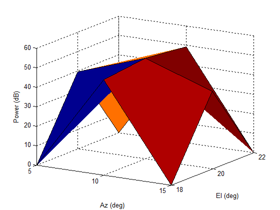

As can be seen, the peak signal was approx at 10° Az, 20° El. Looking at the data received, it was noted that the format was the same as the previous problem. 4 byte float for I, 4 byte float for Q with 10 samples per symbol of QPSK.
As part of the prompt, it was mentioned that the flag would appear after byte 7200. There were 8192 bytes of information provided in each transmission of IQ, so it was possible that part of the flag was contained in the first packet.
However, another possible answer was that the flag was contained after 7200 bytes of decoded data, which seemed more likely. 

Since each symbol contains 2 bits and there were 10 samples per symbol (at 8 bytes per sample of IQ), this meant that each transmission contained 25.6 bytes of data. The flag should then be expected around transmission 282.

The goal was then to keep the signal strength high for at least 290 transmit/receive pairs. The initial approach was just to send the same az/el command every time (az = 10°, el = 20°). This proved to be stable for quite awhile, however the signal began to degrade and was eventually lost.

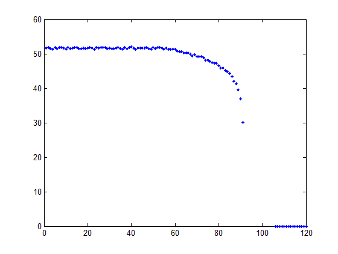

A manual breakpoint was then added to catch when the signal level fell below 40. When this occurred, a manual search was performed until the signal strength was restored. This process was repeated until the satellite stopped providing IQ data.
This occurred after the 299 transmission, which confirmed the earlier assumption about where the flag was likely to occur. By using just 3 additional az/el commands, the signal level was kept high (see figure).

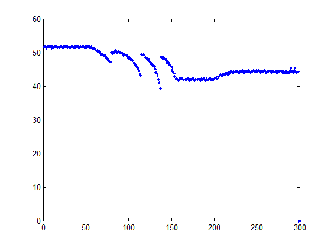

Since the SNR was high, converting IQ to symbols was straightforward and a brute force search through all possible QPSK encoding schemes was performed (trying all combinations of symbol offsets, symbol assignments, and endianness) until the flag was found.


Solution
--------
MATLAB
```
peakPower = zeros(300,1);
az = 10; %starting values for az
el = 20; %starting values for el
allIq = cell(300,1);
for iAz = 1:299
    
    %Manually found pointing to increase SNR
    if iAz == 80
        az = 14;
        el = 18;
    end
    if iAz == 115
        az = 16;
        el = 16;
    end
    if iAz == 136
        az = 18;
        el = 14;
    end
    fwrite(antPoint,sprintf('%0.1f,%0.1f\n',az,el)); %Send pointing command
    
    %Get some IQ data
    data = [];
    while isempty(data)
        nBytes = get(sampServer,'BytesAvailable');
        if nBytes == 8192;
            tmp = fread(sampServer,nBytes);
            data = [data; tmp];
        end
    end
    iqInterleavedFloats = typecast(uint8(data),'single');
    iq = iqInterleavedFloats(1:2:end) + 1i*iqInterleavedFloats(2:2:end);
    
    peakPower(iAz) = max(10*log10(abs(fft(iq,1024))));
    disp(['Peak Power = ',num2str(peakPower(iAz))])
    
    if peakPower(iAz) < 40
        keyboard
    end
end
```

# 4. Small Hashes Anyways
* Category: dead-bugs
* Points: 73
* Solves: 58
* Description: 

```
Micro hashes for micro blaze ¯\_(ツ)_/¯
```

Files:
* [Microblaze Linux rootfs](https://static.2022.hackasat.com/hcx6yv4mw0sgrax3kea36v5vy1vi)
* [small_hashes_anyways](https://generated.2022.hackasat.com/small_hashes_anyways/small_hashes_anyways-bravo589547juliet3.tar.bz2)

Analysis
--------
*Contributors: Wyatt N., Luke N., and Greg B.*

The first download link provided contains a Microblaze-linux rootfs (which also contains some x86-64 compiled utilities for microblaze, like objdump) which is used in this problem and two others in the dead_bugs category. The second download link contains the target binary, small_hashes_anyways. Running file and binwalk on small_hashes_anyways nets the following output:

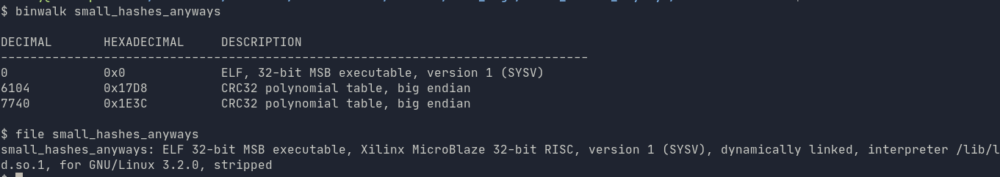
Figure 1: File type, binwalk information.

Note the crc32 polynomial tables discovered by binwalk - this indicates that the "small hashes" used in this program likely utilize crc32 as their hashing algorithm. The binary itself is also a microblaze binary, which will require some sort of emulation to run. Unfortunately at this point in the effort, we did not have direct access to any decomplilation tools beyond the output provided by `qemu-microblaze -d in_asm`. Since the binary was relatively small, we initially focused on just how far we could get without the disassembler.

`small_hashes_anyways` can be run using a microblaze emulator, like `qemu-microblaze`. Upon running with no arguments, it complains about missing libraries. The `ld-linux.so` binary that file reports as the interpreter is found within the linux-microblaze rootfs, so qemu likely has everything it needs to run this binary from the microblaze-linux filesystem provided. QEMU can be made to load the needed interpreter and libraries by pointing `LD_LIBRARY_PATH` environment variable to microblaze-linux/lib, and the `QEMU_LD_PREFIX` to point to the root of the microblaze-linux directory. Using qemu's `-L` flag to point to lib instead does not correctly resolve all of the paths.

The one-liner to get the binary to run is `LD_LIBRARY_PATH=./lib QEMU_LD_PREFIX=./ qemu-microblaze ./small_hashes_anyways`. Upon executing this, a prompt will ask for a string "small hashes anyways: ". Inputting anything other than a correct length string will result in a complaint about not being 112 bytes long.

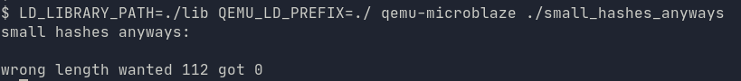
Figure 2: Initial prompt after getting the binary running

Upon putting in a 112 character string as input, you'll be prompted with a different response.

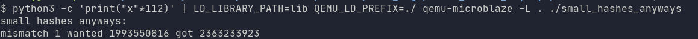
Figure 3: Response upon getting an invalid value.

The binary specifically notes the index (mismatch 1), and provides an "expected" value for what it is looking for. The meaning of this numerical value is unknown, but, given the name of the challenge (hash) and those earlier "crc32" tables we found, it can be assumed that this is a crc32 checksum of some sort. The index provided also indicates that this is likely a single-character checksum, as taking a crc32 checksum of the provided first character will match the sum provided by "got". A simple brute-force for the first character can be done by iterating over all possible utf-8 characters (0-255), taking a crc32 hash of them, and seeing if any match the "wanted" checksum reported by small hashes. In this case, the character 'f' matches the "expected" crc32 hash provided. Putting an f followed by 111 characters produces a different output this time:

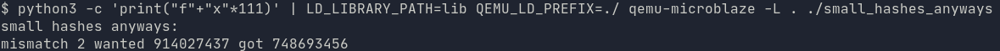
Figure 4: Output upon correctly guessing the first character

The second index hash does not match any of the initial 255 character hashes. Additionally, the hash provided does not match what we put in. Matching it against all possible 2-byte hashes reveals the string 'fl' as the match for the new hash. This seems to imply that the next reported hash takes the first character, then the second "expected" character, hashes them, and outputs that as the "expected" hash from the prompt. 

Since we are looking for a `flag...` style string, we can test this theory by putting in the string `flag` matches the first 4 bytes and see if that matches.


Figure 5: `flag` match.

And if we take that even further, and put the prefix string for the flag format from the hackasat website (`flag{bravo589547juliet3:`), we get an even bigger match. 

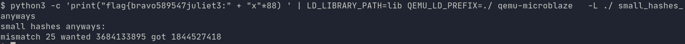
Figure 6: An even bigger match.

We can test our theory of "next byte hash" by taking these "found" strings, taking their checksum, and seeing if the binary reports their checksums if we send them in as "valid" input minus the last character. In this case, `flag` is `3522489242` or `d1f4eb9a` in hex, while `flag{bravo589547juliet3:` produces a checksum of `600809803` or `23cfa14b` in hex.

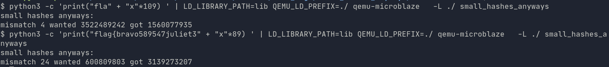
Figure 7: Demonstrating the theory of pre-editing the next hash by adding a single character

In both cases, the next expected hash reported seems to be matching for a string one byte longer than the correct substring up to that point. This gives us the general algorithm for extracting the flag using the "expected" hash. The solution below shows how to get the rest of the flag from the initial bytes from the "flag" format specifier from the website, using the discovered method of brute-forcing the next character in the hash.


Solution
--------

1. Start with the substring for the "flag format" specifier from the quals website: (`flag{bravo589547juliet3:`)

2. Send that string, padded with x's up to 112 characters, into the emulated "small_hashes_anyways" binary.

3. Take the "expected" hash from the output of "small_hashes_anyways", and brute-force the next character by adding a single character from the range 0-255 to the end of the "known" string and taking a crc32 checksum of the new string until a match is found.

3. If we find a match, save the string that produced that checksum as a "known" string, then repeat from step 2 until we have all 112 characters known.

4. After iterating through the remaining characters of the 112 byte string, we will have the flag as the "input" value, and the win condition (swish bay bee) will be printed out by the small_hashes_anyway binary upon entering it.


Here is a script that implements that solution:

```python
#!/usr/bin/env python3
import binascii
from pwn import *

import binascii

csums = {}

def calc_next_byte(known, crc):
    next_str = ""
    for c in range(0, 255):
        next_str = known+chr(c) ## append new char
        sum = binascii.crc32(bytes(next_str, "utf-8"))
        if crc == "{}".format(sum):
            print("Found, known is: %s" % next_str)
            return next_str
        else:
            print("%s mismatch %d" % (crc, sum))

known_str = "flag{bravo589547juliet3:"
first_csum = "3684133895"
cmd = "LD_LIBRARY_PATH=./microblaze-linux/lib QEMU_LD_PREFIX=./microblaze-linux qemu-microblaze small_hashes_anyways"

solved = False
known_string = known_str
unknown_string = ""
crc = first_csum
while solved == False:
    guess_string = known_string
    remaining = 112 - len(guess_string)
    print('need ' + str(remaining) + ' chars')
    guess_string = guess_string+'x' * remaining

    print("sending: " + guess_string)
    p = process(cmd, shell=True)
    d = p.recvuntil("small hashes anyways:")
    p.sendline(guess_string.encode('utf-8'))
    d = p.recvall()
    d_str = d.decode('utf-8').strip()
    output = d_str.split(' ')
    print(output)
    if (output[0] == 'mismatch'):
        print("mismatch")
        print(output)
        crc_need = output[3]
        print("looking for crc: %s" % crc_need)
        known_string = calc_next_byte(known_string, crc_need)
    elif (remaining == 0):
        print("Found flag: %s" % known_string)
        solved = True
```
# 5. Space Jam
* Category: We Get Signal
* Points: 234
* Solves: 10
* Description:

```
It's a noisy world out there and you just want to transmit from your satellite. Use the transmitter controls to transmit the flag to yourself. Make sure you receive the flag before the transmission window ends.

Configure your signal with a JSON command using the following format:

{"frequency":100000,   "constellation":"PSK",   "samples_per_symbol":1000,    "diff_encoding":"OFF","amplitude":100.0}
```

Files:
* none

Analysis
--------
*Contributors: Michael C, Jay S, Emma P, Kevin G, Grant M, Alyssa H, Ben Z, Joey B*

Upon some initial testing, it was observed that there were restriction in place on constellation type and some of the other parameters. It was assumed that the data was formatted in the same manner as previous problems (4bytes of I, followed by 4 bytes of Q). When processing the data for different inputs, it was noticed that the data always looked the same.

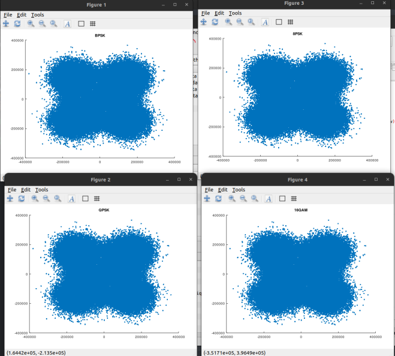

The same processing techniques used on previous problems were attempted, however no valid flag could be found.

After trying many different transmitter controls it was noted that small variations in the resulting data could be seen. While these were at first dismissed as random fluctuations due to noise, it became apparent that the problem had been approached the wrong way.

Flipping things around, the large signal turned out to be noise (Jamming), while the small variations being observed was the actual desired signal. The solution then became clear. Run the process once with an amplitude setting of 0. This data was saved off and contained nothing but the jamming.
Run the process a second time with the same set of parameters, except set the amplitude to 1000.0 (the highest allowable level). QPSK with 10 samples per symbol and no differential encoding were chosen since this was similar to the previous problems

With the two data sets in hand, the clean data became: `Signal = Jam_Plus_Signal - Jam_Only`

The phase of the first 1000 samples of data for these two sets (and the difference) are shown here:

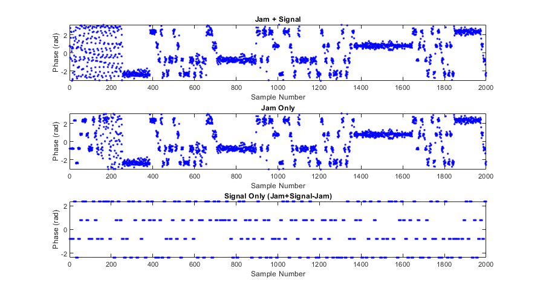

After completing this process, the resulting data was very clean so converting IQ to symbols was straightforward. Again a brute force search through all possible QPSK encoding schemes was performed (trying all combinations of symbol offsets, symbol assignments, and endianness) until the flag was found.

Solution
--------
MATLAB
```
load('noSignalIq.mat'); %Load Jam Only Signal
prevIq = allIq;

obj = tcpip('space_jam.satellitesabove.me',5300,'NetworkRole', 'client');
fopen(obj);

getTCPtext(obj); %asks for ticket
ticket = 'ticket{india900564foxtrot3:GKxCFw-GvSFpyBNk4e64JXOv8LE1qHhzPTYQnA5Eu4ttcBFIzr6ZL7xnCZFLolrt1A}';

%Give ticket
fwrite(obj,sprintf('%s\n',ticket)); 
pause(2.0)
txt = getTCPtext(obj,false);

%Provide JSON command
fwrite(obj,sprintf('%s\n','{"frequency":2100000,   "constellation":"QPSK",   "samples_per_symbol":10,    "diff_encoding":"OFF","amplitude":1000.0}'))
txt = getTCPtext(obj,false); %Get prompt for data address
temp1 = strfind(txt,'Connect via TCP on');
temp2 = strfind(txt,' to get samples');

ip1 = txt(temp1+19:temp2-1);
cf = strfind(ip1,':');

%Connect to sample server
sampServer = tcpip(ip1(1:cf-1),str2double(ip1(cf+1:end)),'NetworkRole', 'client');
set(sampServer,'InputBufferSize',8192)

fopen(sampServer);
pause(4.0)

nBytes = inf;
allIq = [];
while nBytes > 1;
    nBytes = get(sampServer,'BytesAvailable');
    if nBytes == 8192;
        tmp = fread(sampServer,nBytes);
    else
        continue
    end
    betterData = typecast(uint8(tmp),'single');
    iq = betterData(1:2:end) + 1i*betterData(2:2:end);
    allIq = [allIq; iq];
end

signalIq = allIq - prevIq; %clean signal data
```